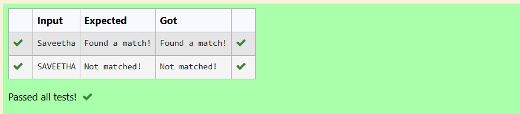

# Match Words Starting with an Uppercase Letter Using Regular Expressions in Python

## 🎯 Aim
To write a Python program that checks whether a given text contains any word starting with an uppercase letter followed by lowercase letters using the re (regular expressions) module.

## 🧠 Algorithm
1.Input a string from the user and store it in a variable text.

2.Define a regular expression pattern r"[A-Z][a-z]+" where:

[A-Z] matches any uppercase letter.

[a-z]+ matches one or more lowercase letters following it.

3.Use the re.findall() function to find all occurrences of the pattern in the input text.

4.If matches list is not empty, print "Found a match!".

5.Otherwise, print "Not matched!".

## 🧾 Program
import re
text=input()
pattern=r"[A-Z][a-z]+"
matches=re.findall(pattern,text)
if matches:
   print("Found a match!")
else:
   print("Not matched!")

## Output

## Result
The expected output is Achieved.