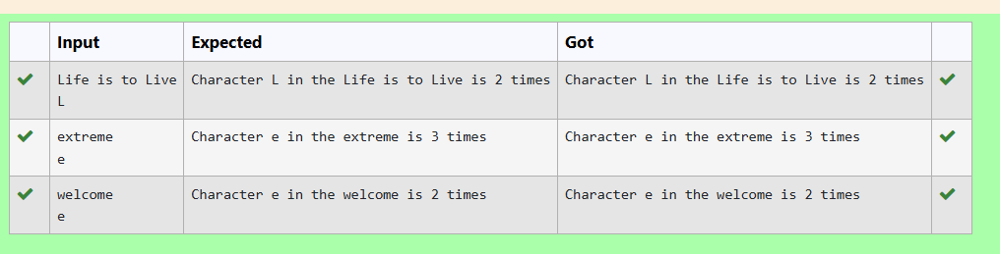

# Count the Number of Occurrences of a Character in a String
## 🎯 Aim
To write a Python program that counts how many times a specific character appears in a given string.

## 🧠 Algorithm
1.Start

2.Input a string from the user and store it in a variable str.

3.Input a character from the user and store it in a variable c.

4.Initialize a variable count to 0.

5.For each character ch in the string str:

6.If ch is equal to c, then increment count by 1.

7.After the loop ends, display the total count of occurrences of c in str.

8.end

## 🧾 Program
str=input()
c=input()
count=0

for ch in str:
    if ch==c:
        count+=1
print("Character {} in the {} is {} times".format(c,str,count))        

## Output

## Result
Thus,the program has been executed successfully.